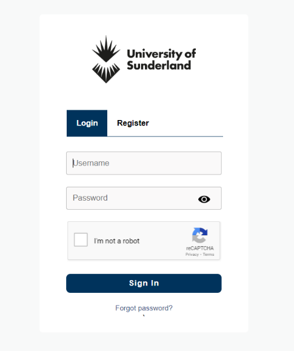
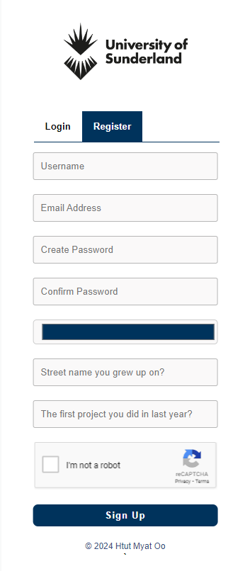

# UOS2024: Web-based Secure Login and Registration System

<p align="left">
  
  
</p>

This is an university assignment-based project called **UOS2024**, where users can login or create the new account into the system. This basic example prototype can be used to initiate **Authentication, Authorization, and Accounting (AAA) framework** to our Apps.

## Security Features

- Google reCAPTCHA and Honeypot
- Text-based Password Strength Meter
- Email Two-Factor Authentication
- Support Authenticator Apps (e.g., Microsoft Authenticator)
- Password Hashing and AES Data Encryption

## Overview System Architecture

<p align="left">
  
</p>

- Install and run on `localhost:8080` using **Apache Server**
- Used **PHPMailer** Libary to send OTPs via Gmail
- Used **Google Authenticator** Libary for TOTP authentication

## Tech Stack

**Client:** HTML, CSS, JavaScript

**Server:** PHP, MySQL

## Installation

#### Local Host Server Installation

- Download and Install [XAMPP](https://www.apachefriends.org/index.html)

#### Project Folder Configuration

```bash
# Clone this project or Download as ZIP file
git clone https://github.com/htutmyatoo/UOS2024.git
```
- Save it in `C:\xampp\htdocs`

#### Apache Configuration

- Replace `C:\xampp\apache\conf\httpd.config` with `UOS2024\conf\httpd.config`

#### SQL Server Configuration

- Replace `C:\xampp\mysql\data` with `UOS2024\conf\data` to create database and table.

#### PHP Configuration

- Replace `C:\xampp\php.ini` with `UOS2024\conf\php.ini`

## Testing

- Use `CURL` or `Postman` to test captcha and honeypot

## Troubleshooting

#### MySQL Module crash

If MySQL shutdown automatically and cannot start properly in XAMPP, 

- Stop all module services from XAMPP control panel
- go to `C:\xampp\mysql`
- rename `C:\xampp\mysql\data` as `C:\xampp\mysql\data_old`.
- copy `C:\xampp\mysql\backup` and rename it to `C:\xampp\mysql\data`
- go to `C:\xampp\mysql\data_old`
- copy `performance_schema` folder, `uos2024` folder, `aria_log.00000001`, `aria_log_control`, `ib_buffer_pool`, `ib_logfile0`, `ib_logfile1`, `ibdata1`, and `ibtmp1` from this repo.
- replace them in `C:\xampp\mysql\data`
- restart MySQL Module service.

## Future Improvement
Since I tried to implement [TypingDNA](https://www.typingdna.com/docs/tutorials.html?_gl=1*1n3sa9*_up*MQ..*_ga*ODIwMDEwMDg1LjE3NzQ0NjY3NjU.*_ga_ZG1G3V030B*czE3NzQ0NjY3NjUkbzEkZzAkdDE3NzQ0NjY3NjUkajYwJGwwJGgw) and use [GeeTest](https://docs.geetest.com/en) instead of Google reCAPTURE v3, I want to implement them if I have more time to read the documentations. Try [GeeTest v4 Demo](https://gt4.geetest.com/demov4/more-float-en.html). Beyond these typical 2FA, we can also add **Face Verification feature**.

## Reference

- [See List of Github Repos](https://github.com/stars/htutmyatoo/lists/web-based-login-and-registration)
- Daemen, J., & Rijmen, V. (2002). The Design of Rijndael: AES - The Advanced Encryption Standard. Springer-Verlag Berlin Heidelberg.
- Ferguson, N., Schneier, B., & Kohno, T. (2010). Cryptography Engineering: Design Principles and Practical Applications. John Wiley & Sons.
- Dinh, N. T. and Hoang, V. T. (2023) “Recent advances of Captcha security analysis: a short literature review,” Procedia computer science, 218, pp. 2550–2562. doi: 10.1016/j.procs.2023.01.229.
- Grigutytė, M. (2023) What is bcrypt and how does it work?, NordVPN. Available at: https://nordvpn.com/blog/what-is-bcrypt/ (Accessed: January 26, 2024).
- Rapid7 (2023) What is a Honeypot? How It Improves Security, Rapid7. Available at: https://www.rapid7.com/fundamentals/honeypots/ (Accessed: January 27, 2024).
- ReCAPTCHA (2023) reCAPTCHA. Available at: https://www.google.com/recaptcha/about/ (Accessed: January 25, 2024).
- Robinson, K. (2020) Is email based 2FA a good idea?, Twilio. Available at: https://www.twilio.com/en-us/blog/email-2fa-tradeoffs (Accessed: January 26, 2024).
- Stu the Security Squirrel (2023) AES-256 encryption guide for IT leaders, Kiteworks | Your Private Content Network. Kiteworks. Available at: https://www.kiteworks.com/secure-file-sharing/aes-256-encryption-guide-for-it-leaders/ (Accessed: January 26, 2024).
- Taylor, C. (2023) Top five (5) risks from SMS-based multifactor authentication, CyberHoot. Available at: https://cyberhoot.com/blog/top-five-risks-from-sms-based-mfa/ (Accessed: January 26, 2024).
- Twilio (2023) What is a Time-based One-time Password (TOTP)?, Twilio.com. Available at: https://www.twilio.com/docs/glossary/totp (Accessed: January 26, 2024).

## Support

If you have any technical error during running or testing, please reach out via **[Matrix](https://matrix.to/#/@htutmyatoo:matrix.org)**.

<p align="left"><a href="https://ko-fi.com/J3J21UINNT" target="_blank">
  
</a></p>
